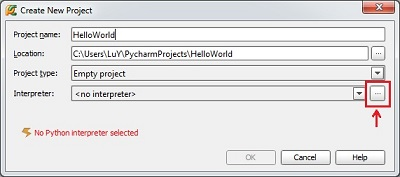
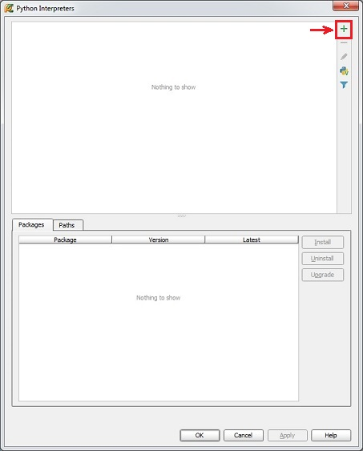
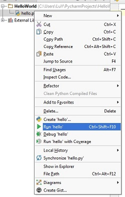
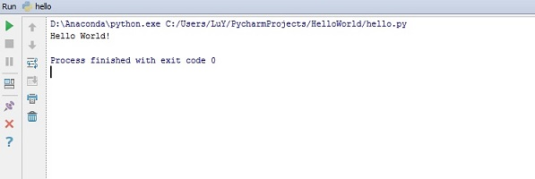

# Quick Links
* Python: https://www.python.org/ 
* PyCharm: http://www.jetbrains.com/pycharm/
* Anaconda: https://store.continuum.io/cshop/anaconda/	

# Getting Started

Here is a simple approach to fast Python development. We are using PyCharm + Anaconda in this course. PyCharm is a cross-platform IDE for Python which has most popular programming features. Anaconda is a rich set of most useful Python packages (contains Python compiler already). Both of them are free and easy to install. You can choose the OS you are familiar with. Here we provide brief instruction on Windows, Mac or Linux.

* Install PyCharm. 
* Install Anaconda.

## Configuring environment
After installation of PyCharm and Anaconda, the next step is to configure the environment and link between the IDE and Python. The user interface for PyCharm is similar under three different OS and we illustrate the Windows version.

1. Open PyCharm.
1. Import educational licence.
1. Menu->File->New Project:
1. Press the button below:
    
1. Press the green add button and select $\anaconda\python.exe and then OK. The IDE will configure automatically.
    
1. Create new Python script file:
    
1. Right click on the .py file to run:
    

## Hello World Python

1. Create helloworld.py
1. Type the following code: ```print('Hello World!')```
1. To run: Right click on .py and select 'Run'.
1. To debug: insert breakpoint similar with Eclipse or Visual Studio. Right click on .py and select 'Debug'

